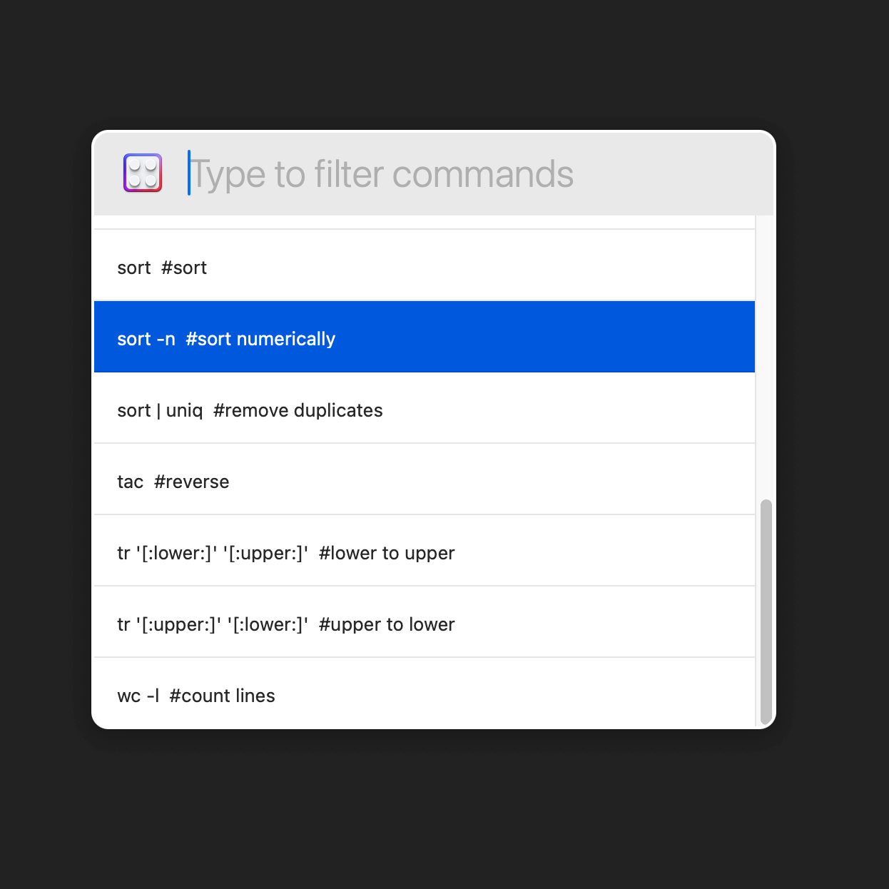

# Filter Through Command

Filter Through Command is an extension for the [Nova editor](https://nova.app).

Run terminal commands on the selected text and have the output replace it, insert after it, or create a new document. The command line is your oyster!

See the internal [README](/Filter%20Through%20Command.novaextension/README.md) for more info.

Recommended download from [Nova Extensions](https://extensions.panic.com/extensions/com.gingerbeardman/com.gingerbeardman.FilterThroughCommand/) website.

# Licence

[MIT](/LICENSE)
